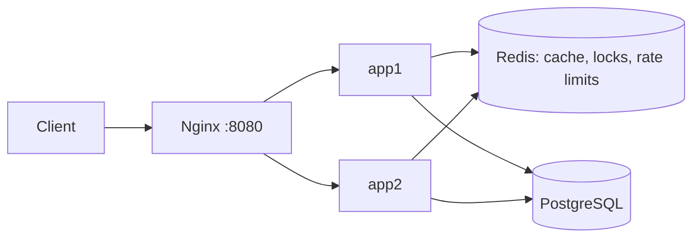

# URL Shortener

A URL shortener built for read-heavy traffic. It uses Redis cache-aside, a stampede-protected cache, a sliding-window rate limiter, and block-based ID allocation, and runs as two stateless instances behind Nginx.

**Stack:** Node.js, TypeScript, Express, PostgreSQL, Redis, Docker Compose, Nginx, k6

## Architecture



- **Create:** `POST /api/shorten` validates the input, passes the rate limiter, takes an ID from the instance's in-memory block, base62-encodes it and inserts into Postgres.
- **Redirect:** `GET /:code` checks Redis first. On a miss it takes a short lock, reads Postgres, fills the cache and returns a `302`.

## Features

- Short codes from base62-encoded IDs (7 characters, about 3.5 trillion combinations)
- Custom aliases (3 to 16 characters) with reserved words blocked, and optional expiry (1 to 365 days)
- Cache-aside Redis caching with a 1-hour TTL, capped at the link's expiry
- Negative caching: missing codes are remembered for 60 seconds
- Cache stampede protection with a Redis lock (`SET NX EX`)
- Sliding-window rate limiter on the create endpoint (Redis sorted set + Lua, atomic)
- Block-based ID allocation: each instance leases 1,000 IDs per database call
- Clean JSON errors: 400 for malformed or invalid input, 404, 409 for alias conflicts, 429 for rate limits

## Run it

Requires Docker Desktop.

```bash
docker compose up -d --build
```

Create a link (PowerShell):

```powershell
Invoke-RestMethod -Method Post -Uri http://localhost:8080/api/shorten -ContentType "application/json" -Body '{"url":"https://github.com","alias":"mygit","expiresInDays":7}'
```

Create a link (bash):

```bash
curl -X POST localhost:8080/api/shorten -H "Content-Type: application/json" \
  -d '{"url":"https://github.com","alias":"mygit","expiresInDays":7}'
```

Follow it:

```bash
curl -i localhost:8080/mygit
```

The create endpoint is limited to 5 requests per minute per client IP by default. Change the limit in `src/index.ts`.

## API

| Method | Path | Body | Responses |
|---|---|---|---|
| POST | `/api/shorten` | `{ url, alias?, expiresInDays? }` | 201, 400, 409, 429 |
| GET | `/:code` | none | 302, 404 |

## Benchmarks

Test: k6, ramping to 50 virtual users over 10 seconds, then holding for 30 seconds, requesting one existing short code through Nginx. All services ran on one laptop.

| Mode | Requests/sec | Avg latency | p95 latency | Errors |
|---|---|---|---|---|
| Postgres only (cache disabled) | ~1,608 | 27.0 ms | 39.2 ms | 0% |
| Redis cache-aside | ~2,489 | 17.4 ms | 30.8 ms | 0% |

The cache gave about 55% more throughput, 36% lower average latency and 21% lower p95 latency.

**Stampede test:** 20 concurrent requests for an uncached key caused 1 database query with the lock enabled.

**Rate limiter test:** with a limit of 5 per minute, 7 rapid requests returned `201 x5` then `429 x2`, and capacity returned as old entries aged out of the window.

**Caveats:**
- Nginx, two Node apps, Postgres, Redis and k6 shared one machine, so absolute numbers are low and noisy. The relative difference matters more.
- The test reads a single hot key from a tiny table, which is close to the best case for Postgres. A larger table and a wider key distribution would widen the gap.
- Both runs are probably limited by CPU in Nginx and Node, not by the database.

## Capacity estimate

Assumptions: 100M new URLs per year and 10B redirects per month.

- Writes: 100M / (365 x 86,400 s) is about 3 per second.
- Reads: 10B / (30 x 86,400 s) is about 3,900 per second on average, so peak may be several times higher. The read path has to be cache-first.
- Storage: about 500 bytes per row (URL, code, timestamps, index) gives about 50 GB per year.
- ID space: 7 base62 characters give 62^7, about 3.5 trillion codes, which lasts for centuries at this rate.

## Design decisions

See [DESIGN.md](DESIGN.md) for the reasoning behind each choice. Short version:

| Decision | Why |
|---|---|
| Sequence stepped by 1,000, IDs leased per instance | Avoids a database call per create, with no collisions across instances. Unused IDs are lost on restart, which is harmless. |
| Database unique constraint for aliases | Check-then-insert would race under concurrent requests. |
| 302 instead of 301 | A 301 is cached by browsers, which would hide repeat clicks from analytics. |
| Lock on cache miss | Prevents many simultaneous requests from querying Postgres for the same cold key. |
| Sliding window in Lua, time from Redis | Fixed windows allow up to 2x the limit across a boundary. Lua makes check-and-add atomic. Redis time avoids clock skew between instances. |
| Rate limiter fails open | Availability is preferred over strict limiting if Redis is down. |

## Known limitations and next steps

- Sequential codes are guessable. A reversible scramble before encoding would fix this.
- An alias could collide with a future auto-generated code. The unique constraint prevents bad data, but the generated insert would fail and should retry.
- Click analytics are not implemented yet. The plan is to process them asynchronously through a separate job queue so redirects never wait on a database write.
- Not deployed yet.